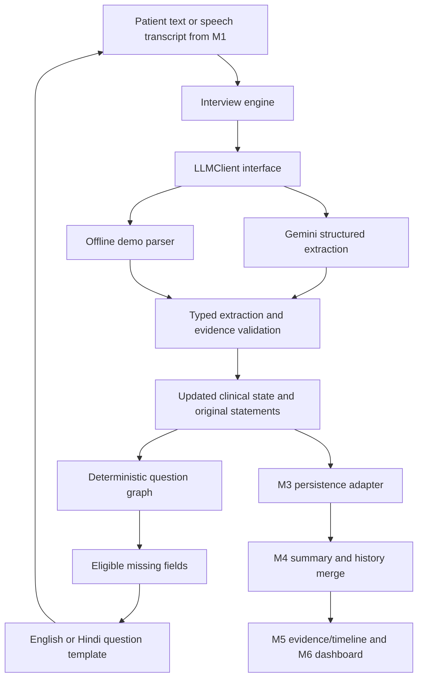
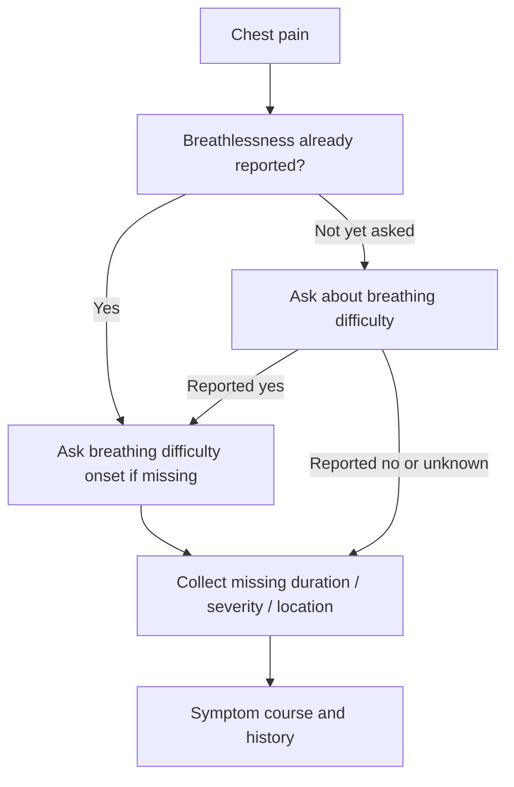

# MEDISAARTHI · M2 Conversational AI

An independently runnable **adaptive pre-consultation interview engine** for SIH Round 1.
It converts a patient's English/Hindi response into typed, patient-reported information,
checks what remains to collect, and returns the next relevant question as JSON.

**Scope:** M2 only. No patient frontend, database, doctor dashboard, diagnosis,
prescription, history retrieval, or physician summary generation is implemented.
The product specification pasted into the task is the primary source; the named
`AI-powered-Pre-Consultation-Intelligence-Platform.txt` was not present in the workspace.

## Quick start (PowerShell, Python 3.11+)

```powershell
cd C:\Users\anura\Desktop\SIH\m2-conversational-ai
python -m venv .venv
.\.venv\Scripts\python.exe -m pip install -r requirements.txt
.\.venv\Scripts\python.exe -m examples.demo
.\.venv\Scripts\python.exe -m pytest -q
$env:M2_LLM_PROVIDER = "mock"
.\.venv\Scripts\python.exe -m uvicorn app.api.main:create_app --factory --host 127.0.0.1 --port 8000
```

Open **http://127.0.0.1:8000/docs** for interactive API requests. No API key is needed.
On macOS/Linux use `.venv/bin/python` instead. The demo generates
`examples/demo-output.json`, including first responses, full records, and final responses
for fever, chest pain, headache, and abdominal pain. All identities are synthetic.

The API is a **local, single-process demo** with ephemeral storage. Restarting it loses
sessions. Use one worker. M3 must provide authorization and durable storage before
sharing an instance or handling real patient records. Localhost CORS is enabled by
default for M1; M3 must configure restricted frontend origins during integration.

## Architecture and data flow



The engine accepts an `Interview` and returns a **new** `Interview`; provider failure
leaves the original untouched. `present()` creates the frontend response envelope.
The optional service owns persistence orchestration through an `InterviewStore` protocol.
Nothing in the engine imports FastAPI or requires a database.

### Why these choices?

| Choice | Purpose |
| --- | --- |
| Python 3.11+ and type hints | Fits M3's Python/FastAPI stack and makes domain interfaces readable. |
| Pydantic 2 | Validates input, extracted facts and clinical values, and generates the shared JSON schemas. |
| Google Gen AI SDK / Gemini API | Real multilingual extraction with Pydantic structured output. |
| `LLMClient` protocol | Change providers without rewriting graph, engine, API, or tests. |
| Declarative dataclass graph | Required fields, priority, conditional branches and completion remain inspectable code. |
| Bilingual question templates | Predictable wording and no extra LLM call for each question; Hindi selection controls prompts, not data keys. |
| Stateless engine plus store protocol | M3 can persist records in its own transactions. The demo memory store is replaceable. |
| Revision checks | Reject stale requests and avoid lost updates when responses arrive concurrently. |
| FastAPI and Uvicorn | Thin optional REST adapter, generated OpenAPI documentation, local demo server. |
| pytest, HTTPX, JSON Schema validator | Test behavior, API lifecycle and exact compatibility of published contracts. |
| Ruff | Consistent formatting and basic static lint checks without a large tooling stack. |
| Mock provider | Repeatable end-to-end demos and unit tests without keys, network, or teammates. |

The LLM **does not control the interview**: it cannot close a session, prescribe a
question, set a priority flag, or call a tool. Its only output is an `Extraction`.
The graph controls collection. M4 will own clinical interpretation and summarization.
There is intentionally no second LLM-generated summary in M2.

## How the question graph works

`graph.py` declares four complaint pathways and shared history questions. Each node
specifies its clinical field, English/Hindi prompt, and optional `when_true` dependency.
Nodes are ordered by collection priority among those currently eligible.

1. Ask for the chief complaint.
2. Normalize it through the provider and choose its pathway.
3. Evaluate conditional nodes against the current clinical state.
4. Skip fields already collected, even when provided before being asked.
5. Ask the first remaining eligible node.
6. An ambiguous answer leaves the field unanswered and triggers a clarification prefix.
7. Explicit “don't know” or “skip” records uncertainty/refusal and advances to other fields.
8. Close when all eligible nodes have been addressed, on explicit completion, or at the turn limit.



For example, “chest pain for 3 days, 7/10, with breathlessness” skips duration,
severity and the yes/no breathing question, then asks about breathing onset.
“No” to the breathing question bypasses that branch. An unsupported complaint uses
a generic duration/course/history pathway; the system does not guess a diagnosis.

To add a pathway, add a `PATHWAYS` entry using existing nodes. To add a new clinical
field, update `ClinicalState`, `ClinicalField`, a bilingual node, extraction guidance,
and tests; then regenerate contracts. Mock vocabulary changes are optional for a
real provider but useful for new demonstrations. These pathways are demonstration
collection rules and require clinical review before actual healthcare use.

## Clinical contracts and evidence

All contract JSON files are generated from runtime Pydantic models. They are standalone
Draft 2020-12 schemas with local `$defs`, so teammates need no Python imports.

| File in `contracts/` | Consumer / meaning |
| --- | --- |
| `patient.schema.json` | Patient ID, optional demographic fields, language; matches the product's names. |
| `interview.schema.json` | Persistable record: IDs, complaint, symptoms, responses, clinical state, completion and revision. |
| `interview_response.schema.json` | Every successful start/respond/complete/get interaction. |
| `clinical_state.schema.json` | English structured values for M3 and M4. |
| `next_question.schema.json` | Stable field ID, localized text, input type and clarification indicator. |
| `start_request.schema.json` | Patient object and explicit consent. |
| `respond_request.schema.json` | Interview ID, response text and expected revision. |
| `complete_request.schema.json` | Interview ID and expected revision. |

Regenerate after changing schemas:

```powershell
.\.venv\Scripts\python.exe -m examples.export_contracts
```

The specification's `patient_id`, `interview_id`, `chief_complaint`, `symptoms`,
`responses` and `completed` names are preserved. The persistable `Interview` retains
top-level complaint/symptom projections for compatibility; **`clinical_state` is the
authoritative current snapshot**. `schema_version`, `revision`, provenance and explicit
completion reasons are additive fields. Do not independently edit the projections.

`extracted` is a typed list of field changes rather than an arbitrary dictionary:

```json
{
  "facts": [
    {"field": "chief_complaint", "value": "fever", "status": "reported", "evidence": "Mujhe 3 din se fever hai."},
    {"field": "duration", "value": "3 days", "status": "reported", "evidence": "Mujhe 3 din se fever hai."}
  ],
  "uncertain_fields": []
}
```

This extension lets M4/M5 trace a value to its original statement rather than treating
it as AI certainty. Each persisted turn includes its question, original statement,
extraction and UTC recording time. Corrections replace the current field while keeping
older turns. A recording timestamp is **not** a disease-onset date. No numeric
confidence score is invented. Evidence substring validation prevents fabricated
quotations, but cannot prove that a model interpreted the quotation correctly.

Replacing the active complaint clears the previous complaint's symptom attributes
and graph progress, while retaining history and all earlier turns. Multi-complaint
reasoning is outside this MVP; review the transcript when a complaint changes.

| Representation | Meaning |
| --- | --- |
| `allergies: null`, field still missing | Not yet collected. |
| `allergies: null`, fact status `unknown` | Patient explicitly does not know. |
| `allergies: null`, fact status `declined` | Patient explicitly skipped. |
| `allergies: []`, fact status `reported` | Patient explicitly reports no known allergies. |
| `breathlessness: false` | Explicit negative response, not absence of mention. |
| `uncertain_fields` | Extraction could not reliably interpret an answer. |

`missing_information` contains currently eligible, unaddressed graph fields.
`unknown_information` contains addressed fields explicitly unknown/declined; the full
record distinguishes those statuses. `completed` means **session closed**, not all
facts known or physician-verified. Inspect `completion_reason`, missing and unknown
information. A skipped chief complaint remains missing because no pathway is known.

## REST API

| Method | Route | Result |
| --- | --- | --- |
| POST | `/interview/start` | 201, initial `InterviewResponse` |
| POST | `/interview/respond` | 200, updated `InterviewResponse` |
| POST | `/interview/complete` | 200, closed `InterviewResponse` with any remaining missing fields |
| GET | `/interview/{interview_id}` | 200, current `InterviewResponse` |
| GET | `/interview/{interview_id}/record` | 200, full `Interview` including original evidence |
| GET | `/health` | 200, reports mock/LLM extraction and memory/external persistence |

Start request:

```json
{"patient": {"patient_id": "P1001", "language": "hi"}, "consent": true}
```

Copy `interview_id` and `revision` from its response:

```json
{"interview_id": "INT_replace_with_returned_id", "response": "Mujhe 3 din se fever hai.", "expected_revision": 0}
```

Abbreviated result (the complete runnable output is in `examples/demo-output.json`):

```json
{
  "schema_version": "1.0",
  "patient_id": "P1001",
  "interview_id": "INT_replace_with_returned_id",
  "revision": 1,
  "clinical_state": {"chief_complaint": "fever", "duration": "3 days", "temperature": null},
  "next_question": {
    "id": "temperature",
    "text": "क्या आपने तापमान मापा है? इकाई भी बताइए।",
    "type": "text",
    "language": "hi",
    "clarification": false
  },
  "completed": false,
  "completion_reason": null
}
```

Send the latest revision on **every mutation**. A 409 means fetch the latest state
before deciding whether to resubmit; do not blindly replay an answer. GET's `extracted`
is the last successful turn's extraction, not a new event. Starting twice creates two
sessions; start-request deduplication is an integration concern for M3.

Errors: 404 unknown interview; 409 stale revision/closed session; 422 invalid input or
missing consent; 502 provider unavailable, refused, malformed, or ungrounded output.
Provider failure leaves stored state unchanged and never silently switches to mock mode.

## LLM configuration

Mock is the default even if an API key exists. Real mode is explicit:

```powershell
$env:M2_LLM_PROVIDER = "gemini"
$env:GEMINI_API_KEY = "your-google-ai-studio-key"
$env:GEMINI_MODEL = "gemini-3.6-flash"
$env:M2_LLM_TIMEOUT_SECONDS = "30"
$env:M2_MAX_TURNS = "40"
.\.venv\Scripts\python.exe -m uvicorn app.api.main:create_app --factory --host 127.0.0.1 --port 8000
```

`.env.example` is a configuration template; `.env` files are **not auto-loaded**.
Set variables in your shell or deployment environment. Secrets are not logged or
stored in records. The model is configurable without guessing which model your
account has access to. The adapter uses `responses.parse(..., text_format=Extraction)`
as described in the [official Gemini Structured Outputs guide](https://ai.google.dev/gemini-api/docs/structured-output).
The SDK has two retries for retryable failures; the timeout is per request, so the
total retry duration may exceed it. There is no real API call in unit tests.

The provider receives the current statement, current question and clinical snapshot;
it does not receive patient ID or demographic identity fields. Statements themselves
may still contain identifying information. `store=False` disables response storage
for this API call; it is not a promise of zero provider retention. Real deployment
requires the team's approved consent, provider/data-retention configuration, and access controls.

### Mock capabilities

The mock recognizes the four complaint phrases in English, a small set of Hindi and
transliterated Hindi equivalents, numeric durations and “teen/तीन din,” severity
such as `7/10`, and contextual `yes/no`, `हाँ/नहीं`, unknown and skip responses.
For a history list use `list: Amlodipine 5 mg, Metformin 500 mg`; use `none` for an
explicit negative list. This `list:` format is **demo-only**, not a real-provider requirement.
Temperature examples: `38 C`, `101 F`. See `mock.py` and `examples/demo.py` for the
deliberately limited vocabulary. Arbitrary Hindi/English understanding requires the
real provider and evaluation; the regex demo is not a medical NLP model.

## Integration with your team

**M1 — Patient UI:** collect identification, language and consent; call start and display
`next_question.text`; submit text or a speech-to-text transcript through respond.
Use `revision` for updates, handle 409/502, and end the screen when `completed` is true.
Speech recognition and speech playback remain outside M2. Show priority notifications
immediately when supplied; do not wait for a final physician summary.

**M3 — Backend/Data:** import the pure engine directly or mount the thin routes behind
your authentication. Own patient identity authorization, consent persistence, transaction
boundaries, retention, rate limits and database storage. Store the full `Interview` JSON.
You can implement `InterviewStore` with atomic revision comparison or invoke the engine
inside your existing persistence layer:

```python
from app.interview.engine import InterviewEngine
from app.interview.schemas import Interview, Patient
from app.llm.mock import MockProvider

engine = InterviewEngine(MockProvider())  # Inject a real provider in your composition root.
record = engine.start(Patient(patient_id="P1001", language="hi"), consent=True)
record = engine.respond(record, "Mujhe 3 din se fever hai.")
wire_record = record.model_dump(mode="json")  # Persist through M3.
restored = Interview.model_validate(wire_record)
ui_response = engine.present(restored).model_dump(mode="json")
```

Install this project into the backend environment with `pip install -e path/to/m2-conversational-ai`.
The requested `app` package name is generic: if M3 also has a top-level package named
`app`, mount this as a separate service or agree a package rename during integration.
This does not change the JSON contracts or domain logic.

**M4 — Clinical Intelligence:** consume `clinical_state`, missing/unknown information,
full `responses` and prototype flags. Merge history retrieved by M3, resolve conflicts
between patient reports and existing records, and generate the physician summary.
M2's history fields contain the patient's reports, never verified database history.

**M5 — Timeline/Evidence:** link a fact using interview ID + turn ID + field, its exact
quotation and recording timestamp. M5 determines event dates and source relationships;
M2 does not create a timeline or assert calibrated confidence.

**M6 — Doctor Dashboard:** consume the eventual M3/M4 contract. Preserve unknowns,
support viewing original interview evidence, and implement physician edits/approval
with M3. M2's `completed` is unrelated to physician approval.

## File-by-file guide

Read **schemas → graph → engine → demo → service → API** first.

| File | Purpose |
| --- | --- |
| `app/interview/schemas.py` | Clinical fields, evidence, session, question and response contracts. |
| `app/interview/graph.py` | Four pathways, common questions, eligibility rules and localization. |
| `app/interview/engine.py` | Start/respond/complete/present logic, state copies and collection progress. |
| `app/interview/state.py` | Store protocol, isolated memory store, service and revision conflicts. |
| `app/llm/client.py` | Provider protocol and sanitized provider error. |
| `app/llm/prompts.py` | Extraction-only instructions, multilingual normalization and uncertainty rules. |
| `app/llm/gemini_provider.py` | Gemini API integration, Pydantic output and sanitized errors. |
| `app/llm/mock.py` | Conservative offline fixture parser with the same provider interface. |
| `app/extraction.py` | Evidence substring check and typed state merge. |
| `app/safety.py` | One clearly labeled prototype flag from the specification. |
| `app/config.py` | Environment settings and dependency construction. |
| `app/api/main.py` | Thin REST routes, request validation and error mapping. |
| `app/**/__init__.py`, `examples/__init__.py` | Package markers, with no import-time service creation. |
| `examples/demo.py` | Four continuous mock interviews. |
| `examples/demo-output.json` | Generated, complete synthetic requests/evidence/results. |
| `examples/export_contracts.py` | Exports the runtime models as standalone JSON schemas. |
| `contracts/*.schema.json` | Eight shared contracts listed above. |
| `tests/test_engine.py` | Adaptive branches, Hindi, ambiguity, uncertainty, completion and state safety. |
| `tests/test_api.py` | REST lifecycle, validation, revisions and isolated applications. |
| `tests/test_provider.py` | Real-adapter behavior with mocked SDK calls; no external request. |
| `tests/test_contracts.py` | Schema drift checks and demonstration payload validation. |
| `pyproject.toml` | Package metadata, dependencies and test/lint configuration. |
| `requirements.txt` | One-command editable install with development tools. |
| `.env.example` | Documented environment configuration without secrets. |
| `.gitignore` | Excludes environment, secrets, caches and generated package metadata. |
| `README.md` | Setup, design explanations, contracts and teammate handoff. |

## Verification and limitations

```powershell
.\.venv\Scripts\python.exe -m pytest -q
.\.venv\Scripts\python.exe -m ruff check .
.\.venv\Scripts\python.exe -m ruff format --check .
```

Tests exercise the requested fever/Hindi/chest-pain/ambiguous/completion scenarios,
all four pathways, explicit unknowns, source preservation, invalid types, errors,
session isolation and wire schemas. These are software checks, not clinical validation.

Implementation verification: **33 tests passed**, and all four offline demos completed.
The installed Starlette test client emits two upstream deprecation warnings about its
HTTPX/AnyIO compatibility layer; they do not fail the tests. The real SDK serialization
and parsing test uses a mock HTTP transport, never a live LLM endpoint.

### M2 handoff self-check

- [x] Followed the supplied Round 1 specification; implemented only M2.
- [x] Independently runnable; mock mode needs no API key, database or frontend.
- [x] Real LLM provider is abstracted; live credentials remain user-configured.
- [x] Typed clinical schemas and generated integration contracts exist.
- [x] Deterministic question graph supports four adaptive complaint pathways.
- [x] English/Hindi question text and tested Hindi extraction examples exist.
- [x] Unknown answers clarify or preserve explicit uncertainty without invented values.
- [x] Tests pass; four complete scenarios are included as runnable demos.
- [x] No autonomous diagnosis, prescriptions or treatment decisions are implemented.
- [x] README documents architecture, API contracts and every source file.
- [x] M3/M4/M5/M6 integration boundaries are explicit.

The live Gemini provider requires your configured key/model; mocked SDK tests do not
establish live account access or extraction accuracy. LLM schema compliance and exact
quotations cannot eliminate misinterpretations. No autonomous diagnosis, prescriptions,
treatment decisions, or certainty claims are produced by engine logic.

One chief complaint is active per interview; a comprehensive multi-complaint interview,
calibrated extraction quality, broad multilingual evaluation, clinician-reviewed question
graphs, and a clinically validated safety system are future work. The chest-pain flag is
an illustrative information handoff, not a triage system. M4 owns full safety/summary logic.

No database, frontend, OCR, ABDM/EHR integration or speech service is required.
M3 owns durable production sessions and secure deployment; M4 owns history merging
and physician summaries; M5 owns timelines; M6 owns review and approval. The module's
main learning points are dependency injection, deterministic collection rules, typed
contracts, provenance, and separating domain logic from HTTP/persistence.

## M1 Patient Frontend added (local integration)

The module `frontend/patient` was added as a standalone Next.js (App Router) interface for
the real patient flow described in the Round 1 assignment.

It implements:

- Welcome
- Language selection (English / Hindi)
- Consent
- Patient identification
- Interview question/answer screen
- Text input and browser-based voice input
- Question playback via speech synthesis (optional)
- Progress and completion
- Direct integration with M2 through:
  - `POST /interview/start`
  - `POST /interview/respond`
  - `POST /interview/complete`
- No mock interview replies in the UI path

Run both services together:

```powershell
cd C:\Users\anura\Desktop\SIH\m2-conversational-ai
.\.venv\Scripts\python.exe -m uvicorn app.api.main:create_app --factory --host 127.0.0.1 --port 8000

cd frontend\patient
Copy-Item .env.example .env
npm install
npm run dev
```

M2 now supports CORS through:

```text
M2_CORS_ORIGINS=http://localhost:3000,http://127.0.0.1:3000
```

Use `M2_LLM_PROVIDER=gemini` and configure `GEMINI_API_KEY` and `GEMINI_MODEL`
for real extraction once you provide credentials. Keep `.env` placeholders in place when
credentials are not ready.
